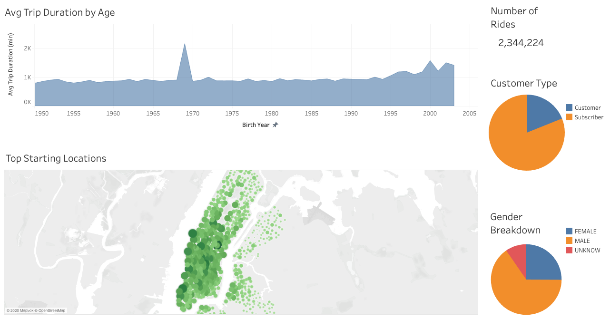
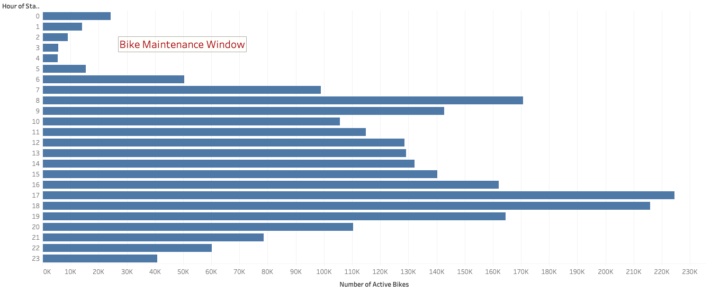
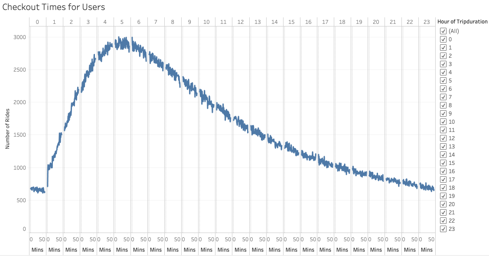
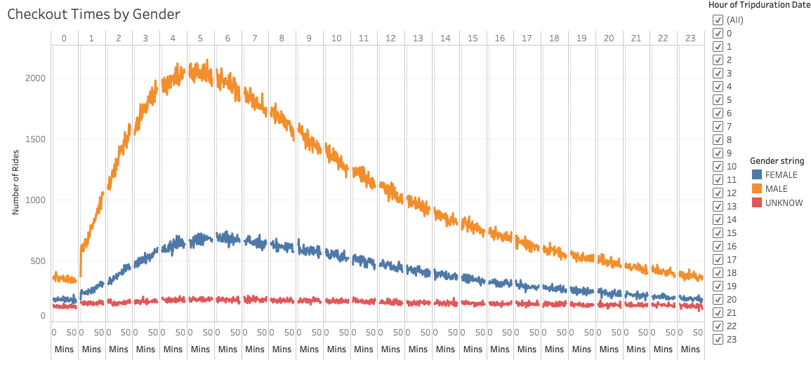
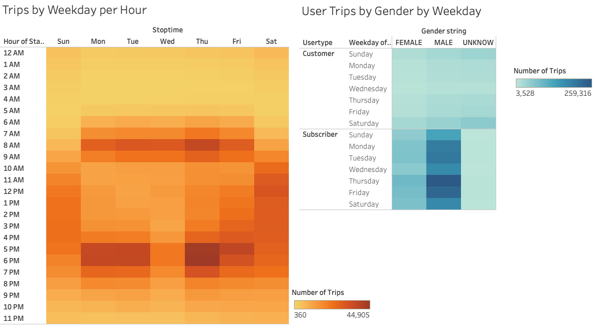
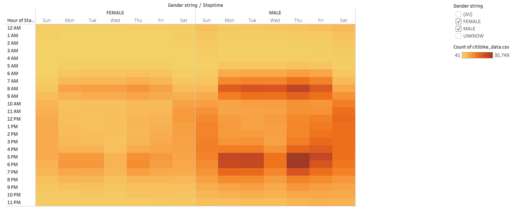

# Bike-Sharing

## Overview
This project is an analysis of New York Citi Bike data, using data visualization tools to explore the viability of a bike-sharing business in Des Moines.

## Sources
- Data Source: [Citi Bike Data](https://www.citibikenyc.com/system-data), [201908-citibike-tripdata.csv.zip](https://s3.amazonaws.com/tripdata/201908-citibike-tripdata.csv.zip)
- Tech Used: Python, Anaconda Navigator, Conda, Jupyter Notebook, Tableau

## Results

### New York Citi Bike data visualizations for August 2019

- There were over 2.3 million rides for the month of August 2019.
- 81% of the users were subscribers. 65% of the users were confirmed males and 25% were confirmed females.
- There is a wide range of the age of the users. Younger users tend to use the service for longer rides.
- Top ride starting locations are in the most touristic and busy areas, as we see here in Manhattan.

#### August Peak Hours

- Highest activity hours are from 5:00 PM to 7:00 PM and require the most resources mobilized.
- The activity from 2:00 AM to 5:00 AM is low so this would be the window for bike maintenance.

#### Checkout times for users

- Bikes are mostly checked out for 4 to 6 hours.

#### Checkout times by gender

- Male users take approximately 3 times more rides than the female users.

#### Trips by weekday and gender

- Most weekday rides are around 7:00 AM to 9 AM and 5:00 PM to 7:00 PM.
- Weekend rides are highest from 10:00 AM to 7:00 PM.
- Those rides are mostly taken by male users.

## Summary
The data shows high activity of the bike sharing service in New York during the month of August 2019.

Additional analysis would be beneficial by :
- comparing data for different months to determine trends across the year,
- including weather data to find the correlation between the weather and the rides. 